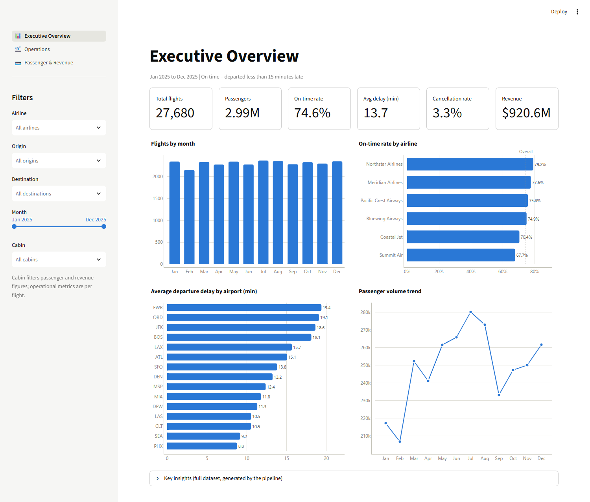
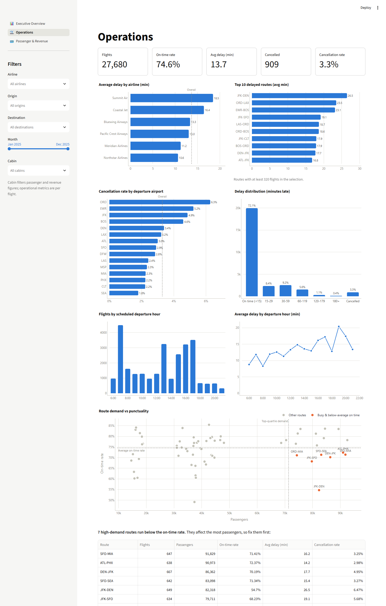
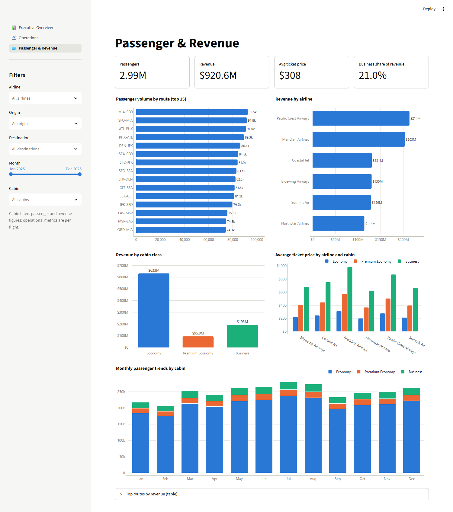
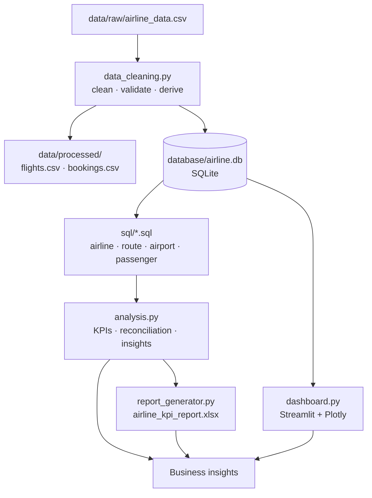

# Airline Operations & Passenger Analytics

An end-to-end analytics pipeline for analyzing airline operational performance, passenger demand, delays, cancellations, and revenue using Python, SQL, Excel, and Streamlit.

```
raw CSV → Python cleaning → SQLite → SQL analysis → KPIs → Excel report + Streamlit dashboard → insights
```

**Live demo:** _add your Streamlit Cloud link here_

## Dashboard

**Executive Overview:** headline KPIs, monthly volume, on-time rate by airline, delay by airport, passenger trend



**Operations:** delays by airline, route, airport and hour, the delay distribution, and a demand-vs-punctuality view of every route



**Passenger & Revenue:** passenger volume by route, revenue by airline and cabin, fares, and monthly cabin mix



Every page responds to the sidebar filters (airline, origin, destination, month range, cabin). When a filter is active, the KPI cards show the change against the full network.

## Features

- **Automated data cleaning:** deduplication, type fixes, mixed date formats, currency strings, inconsistent casing, and targeted imputation, with a cleaning log of every fix
- **Validation:** the pipeline fails loudly if cleaned data breaks an assumption (nulls, duplicate keys, cancelled flights with passengers, per-flight attributes that disagree across cabins)
- **Normalised SQLite database:** a `flights` table (one row per flight) and a `bookings` table (one row per flight × cabin), with keys, constraints and indexes
- **SQL-based analysis:** 15 named queries using CTEs, window functions (`RANK`, `NTILE`, `LAG`, `SUM() OVER`), conditional aggregation and joins
- **Reconciliation:** headline KPIs are computed in both pandas and SQL, and the pipeline asserts they match
- **Airline, route, airport, passenger and revenue analysis**, including the question "which busy routes run late?"
- **Automated Excel reporting:** a six-sheet formatted workbook with native Excel charts and conditional formatting
- **Interactive dashboard:** Streamlit + Plotly, three pages, cross-filtering

## Tech Stack

Python · Pandas · NumPy · SQL · SQLite · Plotly · Streamlit · OpenPyXL · Git

## Architecture



## Key Insights

These come from the pipeline output (`data/processed/insights.md`). `run_pipeline.py` regenerates them.

1. **Summit Air has the highest delay rate.** 32.2% of its flights left 15+ minutes late (18.4 min average delay), against 20.8% for Northstar Airlines, the most punctual carrier.
2. **Chicago O'Hare (ORD) is the most disrupted airport.** 16.9% of its departures were cancelled or left 60+ minutes late, 1.6× the network average of 10.3%. It also has the highest cancellation rate (6.3% against 3.3% network-wide). Phoenix (PHX) is the least disrupted, at 5.8%.
3. **Seven of the busiest routes run below the network on-time rate of 74.6%.** JFK-DEN stands out: it is in the top passenger quartile (82K passengers) but only 54.7% of its flights are on time, with an average delay of 26.5 minutes. These routes affect the most passengers, so they should be fixed first.
4. **Revenue is concentrated.** MIA-SFO is the top revenue route at $41.3M (4.5% of the total), and the top 10 routes produce 36.8% of all revenue.
5. **Delays build up through the day.** Departures before 09:00 average 10.6 minutes of delay (79.0% on time). Departures from 18:00 average 16.3 minutes (71.8% on time).
6. **Summer is the weakest season operationally.** July had the worst punctuality (65.2% on time) and also the highest passenger volume (280K), so the most flying happens when the operation is weakest. September was the best month (81.8%).
7. **Business class is 8.4% of passengers but 21.0% of revenue**, with an average fare of $770 against $250 in Economy.

## Dataset

`data/raw/airline_data.csv` has 77,508 rows, one per flight × cabin class, covering 27,680 flights by six airlines across 15 US airports in 2025.

**The data is synthetic.** Public flight datasets such as BTS On-Time Performance include delays and cancellations but no passenger counts, fares or cabin classes, so no single public dataset supports this analysis. [`scripts/generate_raw_data.py`](scripts/generate_raw_data.py) generates the data with a fixed seed. The airline names are fictional. The airports are real, but their figures here are illustrative, not real performance. The generator builds in realistic structure: hub congestion, winter snow and summer storms, delays that build up through the day, storm days, and fares and load factors that vary by season, weekday, distance and cabin. It also adds the kind of mess a real export has, so the cleaning step has real work to do:

| Issue injected | Handled by |
|---|---|
| Exact duplicate rows | `drop_duplicates` (919 removed) |
| `$` in ticket prices, negative prices | parsed, invalid values nulled, then imputed |
| Mixed date formats (`2025-03-14`, `03/14/2025`) | `pd.to_datetime(format="mixed")` |
| `Yes/No/Y/N/1/0/TRUE/FALSE` cancellation flags | mapped to 0/1 |
| Inconsistent airline / airport casing | standardised |
| Missing delay or actual departure time | each derived from the other (handles midnight rollover) |
| Missing passengers / prices / distance | imputed from the same flight number, route-cabin-month, or route |

**Metric definitions**
- **On time:** departed less than 15 minutes after schedule (US DOT threshold). The rate is measured over operated flights.
- **Average delay:** departure delay with early departures counted as 0, over operated flights.
- **Disruption rate:** share of departures cancelled or 60+ minutes late.
- **Revenue:** passengers × average ticket price, per cabin. Cancelled flights carry 0 passengers.

## Project Structure

```
airline-operations-analytics/
├── data/
│   ├── raw/airline_data.csv        # source data (never modified)
│   └── processed/                  # cleaned tables, KPI CSVs, insights (generated)
├── database/airline.db             # SQLite (generated)
├── sql/                            # the analytical queries
│   ├── airline_analysis.sql
│   ├── route_analysis.sql
│   ├── airport_analysis.sql
│   └── passenger_analysis.sql
├── src/
│   ├── config.py                   # paths and constants
│   ├── data_cleaning.py            # clean, validate, split into tables
│   ├── database.py                 # schema, loading, query runner
│   ├── analysis.py                 # SQL runner, pandas KPIs, reconciliation, insights
│   └── report_generator.py         # Excel report (OpenPyXL)
├── reports/airline_kpi_report.xlsx # generated Excel deliverable
├── scripts/generate_raw_data.py    # synthetic dataset generator
├── docs/screenshots/
├── dashboard.py                    # Streamlit app
├── run_pipeline.py                 # runs the whole pipeline
└── requirements.txt
```

## Running Locally

```bash
conda create -n airline_analytics python=3.11
conda activate airline_analytics
pip install -r requirements.txt

python run_pipeline.py          # clean → SQLite → SQL → KPIs → Excel (about 15 s)
streamlit run dashboard.py      # opens the dashboard in your browser
```

`run_pipeline.py` prints the cleaning log, checks pandas against SQL, prints the insights, and writes `reports/airline_kpi_report.xlsx`. The dashboard builds the database on first launch if it is missing, which is how the Streamlit Cloud deployment works.

## Excel Report

`reports/airline_kpi_report.xlsx` is generated automatically and has six sheets:

| Sheet | Contents |
|---|---|
| Executive Summary | Headline KPIs, key insights, data-quality log |
| Airline Performance | Airline scorecard, time-of-day performance, monthly trends, chart |
| Route Analysis | High-demand/low-punctuality routes, top delayed routes, all routes ranked, carrier comparison on shared routes |
| Airport Analysis | Disruption ranking, seasonal on-time rate, delay by hour, chart |
| Passenger Analysis | Monthly passengers by cabin with month-over-month change, cabin mix, chart |
| Revenue Analysis | Revenue by airline, top 10 routes, revenue by cabin, chart |
